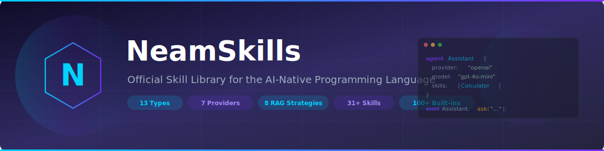

<p align="center">
  
</p>

<p align="center">
  <a href="https://github.com/neam-lang/NeamSkills/blob/main/LICENSE"></a>
  <a href="https://github.com/neam-lang/Neam"></a>
  <a href="https://github.com/neam-lang/NeamSkills"></a>
  <a href="https://github.com/neam-lang/NeamSkills"></a>
  <a href="https://neam-lang.github.io/Neam-The-AI-Native-Programming-Language/"></a>
  <a href="#install-from-github"></a>
  <a href="#install-from-github"></a>
</p>

<p align="center">
  <b>Official skill library for the <a href="https://github.com/neam-lang/Neam">Neam programming language</a></b><br/>
  <sub>The compiled, AI-native language for building agent systems</sub>
</p>

---

Neam is a compiled AI agent programming language. This repo gives you three things:

1. **`Claude-Neam-Programming-skill`** — comprehensive Claude Code skill covering the full Neam language (recommended)
2. **`neam-programming` skill** — lightweight quick-reference skill for Claude Code
3. **31 ready-made `.neam` skills** — copy into your agents to add abilities instantly

---

## New to Neam? Start Here

Import the comprehensive skill into Claude Code:

```bash
/import skills/claude-neam-programming/SKILL.md
```

This gives Claude full knowledge of Neam — all 13 data types, agents, claw/forge agents, multi-agent orchestration, RAG (8 strategies), skills, MCP, guards, policies, OOP (structs/traits/sealed types), modules, cloud deployment, and 100+ built-in functions.

**Lightweight alternative** (quick reference only):

```bash
/import skills/neam-programming/SKILL.md
```

---

## Install from GitHub

### Option 1: Install as a Plugin (recommended)

Add the NeamSkills marketplace and install — three commands:

```bash
/plugin marketplace add neam-lang/NeamSkills
/plugin install neam-skills@neam-lang-NeamSkills
/reload-plugins
```

Once installed, the skill auto-activates when you work with `.neam` files or ask about Neam. You'll see it as `/claude-neam-programming` in your available skills.

> **Verify it worked:** After `/reload-plugins`, you should see `neam-skills:claude-neam-programming` and `neam-skills:neam-programming` in your available skills.

### Option 2: Personal Skill (quick, works everywhere)

```bash
mkdir -p ~/.claude/skills/claude-neam-programming
curl -sL https://raw.githubusercontent.com/neam-lang/NeamSkills/main/skills/claude-neam-programming/SKILL.md \
  -o ~/.claude/skills/claude-neam-programming/SKILL.md
```

Then use `/claude-neam-programming` in any Claude Code session.

### Option 3: Project-level Skill (shared with team)

```bash
# From your project root:
mkdir -p .claude/skills/claude-neam-programming
curl -sL https://raw.githubusercontent.com/neam-lang/NeamSkills/main/skills/claude-neam-programming/SKILL.md \
  -o .claude/skills/claude-neam-programming/SKILL.md
```

Commit to version control — the skill is available to anyone who clones your repo.

---

## Quick Example

```neam
// 1. Copy a skill from this repo into your .neam file
skill Calculator {
  description: "Perform math operations",
  params: [
    { name: "operation", schema: { "type": "string", "description": "add/sub/mul/div" } },
    { name: "a", schema: { "type": "number", "description": "First number" } },
    { name: "b", schema: { "type": "number", "description": "Second number" } }
  ],
  impl: fun(operation, a, b) {
    if (operation == "add") { return a + b; }
    if (operation == "sub") { return a - b; }
    if (operation == "mul") { return a * b; }
    if (operation == "div") { return a / b; }
  }
}

// 2. Attach it to your agent
agent MathBot {
  provider: "openai",
  model: "gpt-4o-mini",
  system: "You are a math assistant. Use Calculator to solve problems.",
  skills: [Calculator]
}

// 3. Run it
emit MathBot.ask("What is 25 multiplied by 4?");
```

---

## Claude Code Skills

### `Claude-Neam-Programming-skill` (Recommended)

> **1,394 lines** — Complete Neam language reference for Claude Code

| Area | Coverage |
|------|----------|
| **Core Language** | 13 data types, variables, functions, control flow, comprehensions, pipe operator, destructuring |
| **OOP** | Structs, traits, impl blocks, sealed types, match expressions, generics |
| **Error Handling** | try/catch/throw, panic, Option (Some/None), Result (Ok/Err), context chaining |
| **Agents** | Stateless agents, 7 LLM providers, vision/multimodal, structured output |
| **Multi-Agent** | Runners, handoffs, spawn, dag_execute, 10 orchestration patterns |
| **NeamClaw** | Claw agents (sessions, channels, lanes, semantic memory), Forge agents (build-verify loops, checkpoints) |
| **RAG** | Knowledge bases, 8 retrieval strategies, vector stores, chunking |
| **Skills & Tools** | Skills, tools, extern skills (HTTP/MCP/Claude), MCP servers, adopt |
| **Security** | Guards (6 handler types), guard chains, policies, budgets |
| **Modules** | Module system, imports, visibility, package manager (neam-pkg) |
| **Deployment** | Docker, Kubernetes, Lambda, Cloud Run, ECS, Terraform |
| **Cloud Config** | neam.toml, state backends, LLM gateway, telemetry, secrets management |
| **Built-in Functions** | 100+ functions: math, string, list, map, file, HTTP, crypto, time, regex, async |
| **Testing** | Test blocks, 9 assertion types |

### `neam-programming` (Lightweight)

> **623 lines** — Quick-reference skill for basic Neam development

---

## Skills Library

### Utility
| Skill | Description |
|-------|-------------|
| `Calculator` | Add, subtract, multiply, divide, power, square root |
| `UUIDGen` | Generate a random UUID v4 |
| `GetTimestamp` `FormatTime` | Current time and date formatting |
| `TextUpper` `TextLower` `TextTrim` | Text transformations |
| `Hasher` `Base64Encode` | SHA256/SHA1/MD5 hashing, Base64 encoding |

### Web
| Skill | Description |
|-------|-------------|
| `WebFetch` | Fetch a URL with HTTP GET |
| `HTTPRequest` | Full HTTP requests — POST, GET, PUT, DELETE |
| `URLBuilder` | Build URLs from base, path, and query params |

### Data
| Skill | Description |
|-------|-------------|
| `JSONParser` `JSONFormatter` | Parse and format JSON |
| `CSVParser` | Parse CSV text into rows |
| `DataCounter` | Count items in a JSON array |

### File
| Skill | Description |
|-------|-------------|
| `FileReader` | Read a file from disk |
| `FileWriter` | Write content to a file |
| `FileExists` | Check if a file exists |
| `FileCopy` | Copy a file from one path to another |

### Math
| Skill | Description |
|-------|-------------|
| `UnitConverter` | Convert km/miles, kg/lbs, celsius/fahrenheit, meters/feet |
| `FindMax` `FindMin` | Max and min from a list of numbers |

### Security
| Skill | Description |
|-------|-------------|
| `PasswordValidator` | Check password strength |
| `HMACSign` | Generate an HMAC signature with a secret key |

### Development
| Skill | Description |
|-------|-------------|
| `LogFormatter` | Format log messages with timestamp and level |
| `JSONValidator` | Validate whether a string is valid JSON |

### Productivity
| Skill | Description |
|-------|-------------|
| `WordCounter` `CharCounter` | Count words and characters in text |
| `DaysFromNow` `TimestampToDate` | Future dates and timestamp conversion |

---

## Repo Structure

```
NeamSkills/
├── .claude-plugin/
│   └── plugin.json           ← Plugin manifest (for /plugin install)
├── .claude/
│   └── skills/               ← Project-level skills (auto-discovered)
│       └── claude-neam-programming/
│           └── SKILL.md
├── assets/
│   └── banner.svg
├── skills/
│   ├── claude-neam-programming/ ← Full Claude Code skill (recommended)
│   │   ├── SKILL.md
│   │   └── README.md
│   ├── neam-programming/        ← Lightweight Claude Code skill
│   │   └── SKILL.md
│   ├── utility/              ← Ready-made .neam skills
│   │   ├── calculator/
│   │   ├── uuid-gen/
│   │   ├── timer/
│   │   ├── text-tools/
│   │   └── hasher/
│   ├── web/
│   │   ├── web-fetch/
│   │   ├── http-request/
│   │   └── url-builder/
│   ├── data/
│   │   ├── json-tools/
│   │   ├── csv-parser/
│   │   └── data-counter/
│   ├── file/
│   │   ├── file-reader/
│   │   ├── file-writer/
│   │   ├── file-exists/
│   │   └── file-copy/
│   ├── math/
│   │   ├── unit-converter/
│   │   └── statistics/
│   ├── security/
│   │   ├── password-validator/
│   │   └── hmac-sign/
│   ├── development/
│   │   ├── log-formatter/
│   │   └── json-validator/
│   └── productivity/
│       ├── word-counter/
│       └── date-calculator/
└── README.md
```

---

## Upcoming Skills

| Skill | Status | Description |
|-------|--------|-------------|
| `Claude-Neam-Programming-skill` | Available | Full Neam language reference (1,394 lines) |
| `Claude-Neam-special_agents-skill` | Planned | Cognitive agents, voice agents, A2A protocol, advanced orchestration |

---

## Links

- [Neam Language](https://github.com/neam-lang/Neam) — compiler, runtime, REPL
- [Neam Documentation](https://neam-lang.github.io/Neam-The-AI-Native-Programming-Language/) — full language book (28 chapters)
- [Smart Support Claw](https://github.com/neam-lang/smart_support_claw) — production claw agent example
- [NeamForge Site Generator](https://github.com/samsuljahith/neamforge-site-generator) — forge agent example

---

## License

MIT
